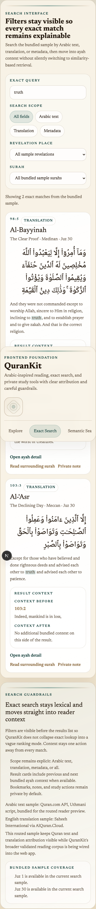
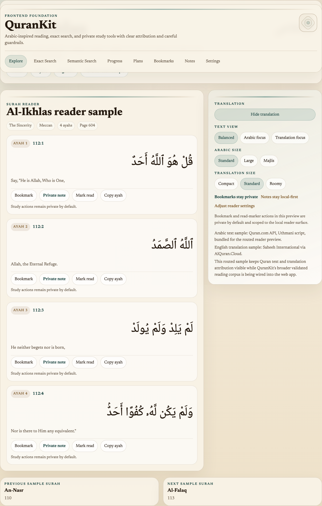

# QuranKit v1 Release Demo

This guide packages the commands, screenshots, and talking points for a QuranKit v1 walkthrough. Use it when preparing a GitHub release, README refresh, or recorded demo.

## Demo Principles

- Preserve Quran text exactly as sourced.
- Keep source attribution visible whenever Quran text or translations appear.
- Present semantic search as related passages by textual similarity only, never tafsir, fatwa, or a religious ruling.
- Keep bookmarks, notes, plans, and reading progress private by default.

## Hosted Demo Notes

- QuranKit v1 does not publish a permanent hosted demo URL yet.
- For release walkthroughs today, prefer a local run or self-hosted Compose stack so private study data stays under the operator's control.
- If a temporary hosted preview is created later, keep private study flows read-only unless the deployment has passed the same privacy review as a self-hosted install.
- Any hosted preview must keep attribution visible and preserve the semantic-search disclaimer.
- The bootstrap Docker API is intentionally limited to `GET /` and `GET /health`. Use the database-backed `apps/api` service plus `http://127.0.0.1:8000/docs` when you need the full versioned API surface in a demo.

## Demo Setup

### Self-Hosting Bootstrap

Use this when you want to show the self-hosting entry path and basic health checks:

```bash
cp .env.example .env
docker compose up --build
```

Open:

- `http://localhost:3000` for the bootstrap web surface
- `http://localhost:8000/health` for the bootstrap API health response

### Local API Docs And Web UI

Use this path when you want to show the implemented API and the current Next.js web experience:

```bash
python3 -m venv .venv
. .venv/bin/activate
python -m pip install -e 'apps/api[dev]'
python -m pip install -e 'apps/cli[dev]'
npm ci
```

Start the API in one terminal:

```bash
cd apps/api
uvicorn qurankit_api.main:app --reload
```

Start the web app in a second terminal from the repository root:

```bash
npm run dev:web
```

Open:

- `http://127.0.0.1:8000/docs` for Swagger UI
- `http://127.0.0.1:8000/openapi.json` for the generated schema
- `http://localhost:3000` for the web UI

### CLI Install Flow

The CLI install path used for release demos is:

```bash
python3 -m venv .venv
. .venv/bin/activate
python -m pip install -e 'apps/cli[dev]'
qurankit config set mode remote
qurankit config set api-url http://127.0.0.1:8000
qurankit config set state-mode local
qurankit config set translation en.sahih
```

Suggested CLI demo commands:

```bash
qurankit search mercy --limit 5
qurankit semantic guide path --limit 5
qurankit progress mark 2:255-257
qurankit bookmark add 2:255 --label "Evening review"
```

This keeps Quran lookup on the local API while leaving progress and bookmarks in the private local study-state path by default.

## Suggested Demo Flow

1. Start with the local Swagger UI and show the browse, exact-search, semantic-search, auth, and private-study route groups.
2. Move to the web UI and show `/search`, `/semantic`, and `/surah/112` so the search disclaimer, attribution, and reader layout are visible.
3. Show one private study flow such as `/progress` or `/bookmarks` to reinforce that study state is private by default.
4. Finish with the CLI install flow plus one exact-search command and one semantic-search command.

## Release Screenshots

These screenshots come from the approved Playwright visual baselines:





Refresh them with:

```bash
npm run test:e2e:update --workspace @qurankit/web
./scripts/export-release-screenshots.sh
```

## GIF Capture Plan

- Clip 1: `/search` to ayah detail on a mobile viewport.
- Clip 2: `/semantic` showing the textual-similarity disclaimer before opening a result in the reader.
- Clip 3: `/surah/112` into `/progress` or `/bookmarks` to show the private local-study flow.
- Clip 4: CLI remote lookup plus local private study-state commands in one terminal recording.
